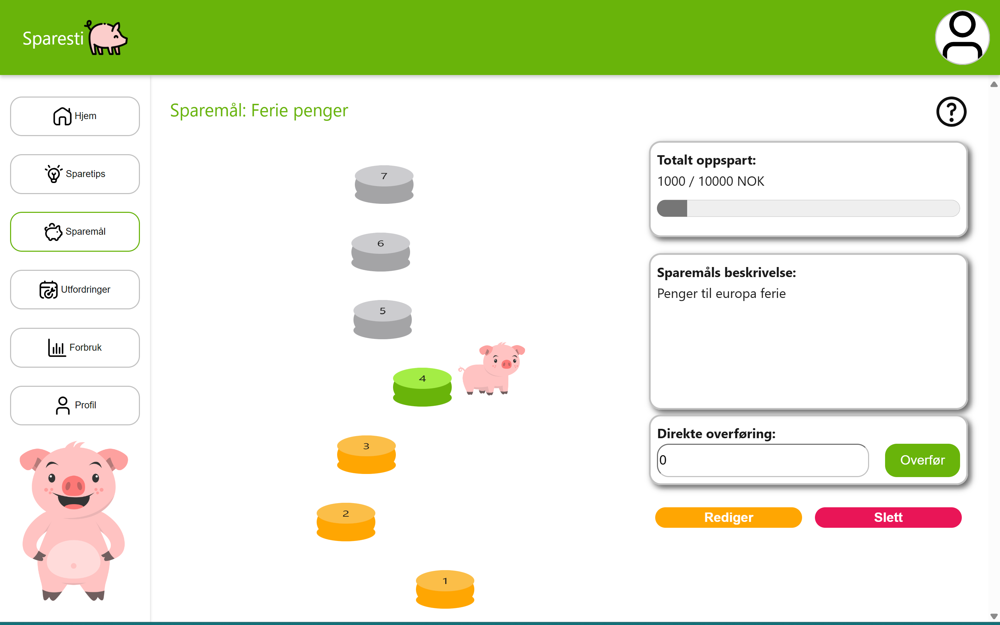
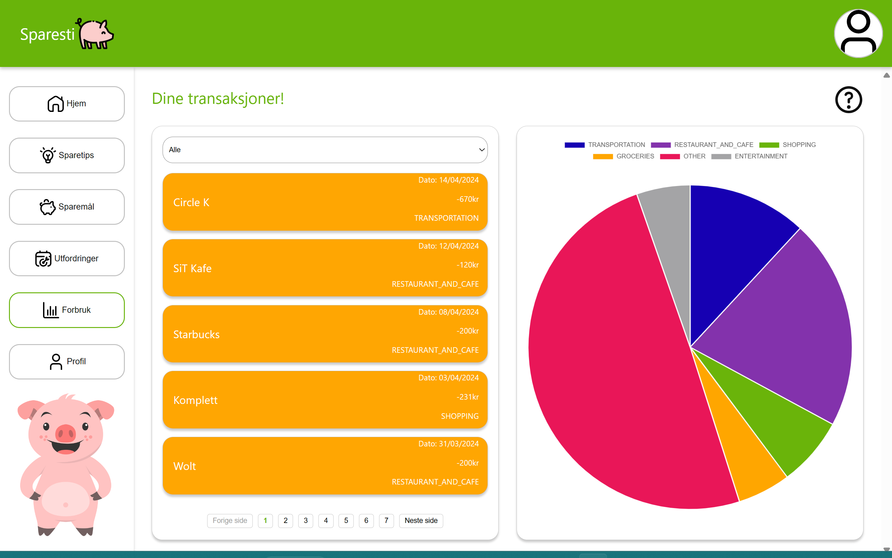

# idatt2106_2024_3_frontend

<div align="center">
  <h1 align="center">Sparesti</h1>
  <h3 align="center">idatt2106_2024_3_frontend </h3>
  <p align="center">
  This is the frontend repository made by Magnus Rindal, Håkon Fredrik Fjellanger, Isak Kallestad Mandal, Sverre Frogner Haugen, Tini Tran, Torbjørn Antonsen, Vilde Min Vikan and Jens Martin Jahle, for the subject System Development with agile methods (IDATT2106) for the spring semester 2024.
  </p>
</div>

## Description

Sparesti is a web application that helps users save money by providing a platform for users to
create and manage savings goals, perform challenges, and track their progress.
The application is designed to be user-friendly and intuitive, making it easy for users to save
money and reach their financial goals.

This repository contains the frontend code for the Sparesti application. The frontend is built using Vue and TypeScript, and it provides the user interface for the application.
The frontend is responsible for displaying the user interface, handling user input, and communicating with the backend API. 
The frontend is designed to be responsive and accessible, making it easy for users to interact with the application on any device.


## Badges

<a href="https://gitlab.stud.idi.ntnu.no/scrum_team_3/idatt2106_2024_03_frontend/-/commits/master"></a>


<a href="https://gitlab.stud.idi.ntnu.no/scrum_team_3/idatt2106_2024_03_frontend/-/commits/master"></a>

## Visuals

### Homepage

### Milestone Playthrough

### Consumption Overview



## Installation and execution

> **Note:** The backend repository must be running in order for the frontend to work as intended.
> The backend repository can be found [here](https://gitlab.stud.idi.ntnu.no/scrum_team_3/idatt2106_2024_03_backend).

### Prerequisites

To run this program you need:

- Node.js
- npm

### Installation

1. Clone the repository using Git:
   ```sh
   git clone https://gitlab.stud.idi.ntnu.no/scrum_team_3/idatt2106_2024_03_frontend
    ```
   
2. Alternatively, you can download the ZIP file and extract it.
    https://gitlab.stud.idi.ntnu.no/scrum_team_3/idatt2106_2024_03_frontend/-/archive/master/idatt2106_2024_03_frontend-master.zip

### Running the repository

1. Navigate to the root folder of the project
2. Run the following command to install the necessary dependencies:
   ```sh
   npm install
   ```
3. Run the following command to start the frontend:
   ```sh
    npm run dev
    ```
4. The frontend should now be running on http://localhost:5173

## Usage

To use the application, open a web browser and navigate to http://localhost:5173.
You can now create an account, log in, and start saving money by creating savings goals and performing challenges.
You need to have the backend running in order to use the application as intended.
Also note that the logged-in user must have a connection to our mock bank in order to use the application as intended.
Use our test user with the following credentials:

- Username: JohnSmith12
- Password: password

## Authors and acknowledgment

This project was made by the following students at NTNU:

Magnus Rindal,
Håkon Fredrik Fjellanger,
Isak Kallestad Mandal,
Sverre Frogner Haugen,
Tini Tran,
Torbjørn Antonsen,
Vilde Min Vikan and
Jens Martin Jahle

## Project status
This project is currently finished and will not be maintained.
There are no plans to continue development on this project in the future.